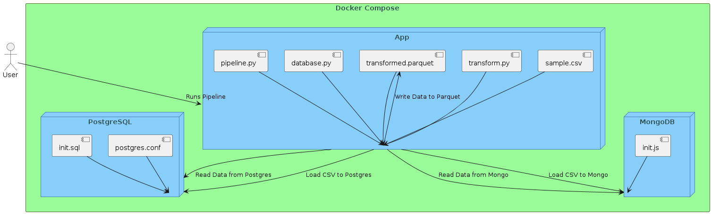

# **Título**: Análisis geoespacial de clientes para optimizar estrategias de ventas y marketing

## Introducción

- **Descripción del Proyecto:** Breve descripción del proyecto y su propósito. ( ##### )

El cliente, empresa dedicada a la comercialización de vestuario, busca comprender mejor a sus clientes B2B en la ciudad. Para ello, se propone un proyecto de análisis geoespacial que tiene como objetivos principales:

## Objetivo:

### Objetivo principal:

Implementar arquitectura para la ejecución de un análisis geoespacial.

### Objetivos secundarios: 

- Identificar patrones espaciales en la distribución de clientes y ventas.  (##### donde estan los mejores)
- Comprender la relación entre la ubicación de los clientes y sus características demográficas. (relacion vs ubicacion)
- Segmentar el mercado en grupos de clientes con características y necesidades similares. ( ##### aunque esto es previo en el mapa se ve que se pueden segmetar mas)
- Desarrollar estrategias de ventas y marketing más efectivas dirigidas a segmentos específicos del mercado. ( ##### diseño de recorridos de entrega pero esto se sale del alcance)

- **Contexto:** Antecedentes y contexto en los que se desarrolla el proyecto.

El proyecto se centrará en mapear la ubicación precisa de los clientes, creando una representación visual detallada de su distribución espacial. Esta información nos permitirá identificar concentraciones de clientes, zonas de potencial crecimiento y áreas que podrían estar subatendidas.

En una etapa anterior, se llevó a cabo una segmentación de mercado utilizando técnicas de machine learning, aprovechando tanto los datos de los clientes como los registros de sus compras. Para este análisis en particular, nos centraremos en la información geoespacial, tomando los resultados de la segmentación previa.

El proyecto de análisis geoespacial incluirá los siguientes pasos:

- Recopilación y preparación de datos: Se recopilarán datos de clientes, ventas y censo de diversas fuentes. Los datos se limpiarán, formatearán y prepararán para el análisis.
- Análisis geoespacial: Se utilizarán técnicas de análisis geoespacial para analizar la distribución espacial de los clientes, las ventas y los datos demográficos. Se identificarán patrones y tendencias en los datos.
- Segmentación del mercado: Se segmentará el mercado en grupos de clientes con características y necesidades similares.
- Desarrollo de estrategias: Se desarrollarán estrategias de ventas y marketing dirigidas a los segmentos de clientes específicos.

Tipo de proyecto: Incremental.

## Datos 

Se utilizarán los siguientes conjuntos de datos

- Información encriptada del cliente (Edad, Género, posición geográfica (longitud y latitud), grupo asignado)
    - Base de datos a utilizar: MongoDB o SQL.
    Justificación: Los clientes pueden tener más de una dirección. Si se desea mantener todas las direcciones, es recomendable usar MongoDB. Si se limita a la última dirección, se puede usar SQL.

- Información geoespacial (polígonos) del Gran Buenos Aires:
    - Base de datos a utilizar: MongoDB o PostGIS.
    Justificación: El uso será limitado y no se necesitarán funciones avanzadas (intersección, unión y búfer). Inicialmente, se requiere calcular distancias desde el punto de la empresa hasta los clientes. Es necesario que la base de datos pueda escalar horizontalmente, ya que los polígonos pueden aumentar en el futuro. Además, su uso es más sencillo comparado con PostGIS, el cuál está diseñado para consultas más complejas como intersección, unión y búfer.

- Información del censo.  
    - Base de datos a utilizar: SQL.
    Justificación: La información original no tiene un formato definido; sin embargo, todos los barrios tienen la misma información: nombre del barrio, número de hombres, número de mujeres y total por edades desde 0 a 110 años (años legales). Por lo tanto, se organiza en formato tabular por barrio y su contenido. Se podría usar MongoDB si se quisiera adicionar información única de cada barrio (número de parques, número de playas, etc.), pero como en este caso no es necesario, se elige usar SQL.

- Información de la encuesta de bienestar. 
    - Base de datos a utilizar: SQL.
    Justificación: La información se manejará a nivel de personas individuales en lugar de casas u hogares, lo que nos proporciona una estructura de datos definida y permite el uso de SQL


- **Alcance:**   ( ##### no estoy seguro que se pone aca)


### Preguntas de negocio (#### propio no se si se deba tener o mover)

- Donde se encuentran los mejores clientes
- Los mejores o los peores se encuentran mas cerca o mas lejos
- Los mejores estan asociados a ingresos?


### Resultados esperados (#### propio no se si se deba tener o mover)

El proyecto se espera que resulte en los siguientes resultados:

- Una mejor comprensión de la distribución espacial de los clientes y las ventas.
- Una comprensión más profunda de la relación entre la ubicación de los clientes y sus características demográficas.
- Segmentos de mercado bien definidos con características y necesidades similares.
- Estrategias de ventas y marketing más efectivas dirigidas a segmentos específicos del mercado.


## Atributos de Calidad (##### ni idea)

- **Escalabilidad:** Cómo la arquitectura puede manejar un aumento en la carga de trabajo. 
- **Rendimiento:** Expectativas de rendimiento y cómo se medirá.
- **Disponibilidad:** Nivel de disponibilidad requerido y cómo se logrará.
- **Seguridad:** Medidas de seguridad implementadas para proteger los datos.
- **Mantenibilidad:** Cómo se asegurará que la arquitectura sea fácil de mantener y actualizar.
- **Confiabilidad:** Nivel de confiabilidad y cómo se garantizará.

## Descripción de la Arquitectura (##### ni idea)
- **Diagramas de Arquitectura:** Diagramas que ilustren la arquitectura del sistema.
- **Componentes:** Descripción de los principales componentes del sistema y sus responsabilidades.
- **Flujo de Datos:** Cómo se mueven los datos a través del sistema. (##### falta definirlo)

### Arquitectura (##### ni idea)
- Componentes


## Tecnologías Utilizadas
- **Lenguajes de Programación:** Se utilizara Python
- **Frameworks y Librerías:** keplergl, dash
- **Plataformas y Servicios:** (##### ni idea)

## Configuración e Instalación
- **Requisitos Previos:** Python 3.10 (##### revisar el docker compose)
- **Instrucciones de Instalación:** Pasos detallados para instalar y configurar el proyecto.
- **Configuración Inicial:** Configuraciones iniciales que deben ser realizadas antes de ejecutar el proyecto.

### <a id='1'>Local usage of App </a>

1. Download the repository.

```bash
ssh git clone repositorio (add)
```

2. Navigate to the xxx folder.

```bash
cd folder/
```

3. Run the following Docker command:

```bash
docker compose build
```
After

```bash
docker compose up
```

4. Navigate to the "App" folder to run the App application, and execute it with the following instruction.

```bash
ssh python3 app.py
```

5. To access the app, open your preferred browser and enter the following command: (verificar si es 8080)

```bash
http://localhost:8080/
```

## Uso del Proyecto
- **Guía de Usuario:** Instrucciones sobre cómo usar el proyecto.

Al iniciar un mapa con la aplicación Kepler se mostrará una vista similar a la que se muestra en la siguiente imagen.


1. Viñeta para desplegar funciones relacionadas con los datos.
2. Bones para desplegar funciones relacionadas con el mapa

Al despliegar la viñeta 1 se mostrará una vista similar a la que se muestra en la siguiente imagen.


1. Botones para capas, filtros y otros.
2. Datos cargados actualmente.
3. Capas de datos cargadas actualmente; puede haber más de una capa a la vez.
4. Botón para crear una nueva capa, disponible solo si se tienen datos cargados previamente.

- **Ejemplos de Uso:** Ejemplos prácticos de cómo interactuar con el sistema.

Al iniciar un mapa, en este ejemplo, los barrios y comunas del Gran Buenos aires, se mostrará una vista similar a la que se muestra en la siguiente imagen.


1. Mapa
2. Datos y capas cargados actualmente, los cuales se pueden modificar

(##### agregar videos)

En laviñeta de filtros se pueden aplicar filtros a necesidad, se mostrará una vista similar a la que se muestra en la siguiente imagen.(#### modificar imagen)

 

## Pruebas y Validación (##### ni idea)
Estrategia de Pruebas: Cómo se realizarán las pruebas para asegurar la calidad.
Casos de Prueba: Ejemplos de casos de prueba que se utilizarán.
Resultados Esperados: Resultados esperados de las pruebas.
 
## Pruebas y Validación (##### ni idea)
Estrategia de Pruebas: Cómo se realizarán las pruebas para asegurar la calidad.
Casos de Prueba: Ejemplos de casos de prueba que se utilizarán.
Resultados Esperados: Resultados esperados de las pruebas.

## Mantenimiento y Soporte (##### ni idea)
Guía de Mantenimiento: Procedimientos y mejores prácticas para mantener el sistema.
Soporte: Cómo obtener ayuda y soporte para el proyecto.

## Contribuciones (##### ni idea)
Guía de Contribución: Cómo otros pueden contribuir al proyecto.
Políticas de Código: Normas y políticas para contribuir con código al proyecto.

## Licencia (##### ni idea)
Licencia del Proyecto: Detalles sobre la licencia bajo la cual se distribuye el proyecto.


# Instalacion
pip install pymongo pandas flask python-dotenv xlrd openpyxl
python upload_data.py
python app.py

docker-compose up -d


# Subir archivos pesados 
git lfs install
git lfs track "*.gl.html"
git lfs push --all origin main
git add .
git commit -m "carga pureba"
git push

# traer a local
git checkout main 
git fetch origin main 
git merge origin/main

# subir
git add . 
git commit -m "cargue1" 
git push