# GeoMarketing: Optimiza tus ventas y marketing con datos geográficos.


Class: Tópicos de bases de datos <br>
Code: 8289 <br>
Members:

    Felipe Rodríguez- @japipe05
    Oscar Correa - @oe_correcha

## Table of Contents

- <a href='#1'>1. Introducción</a>
- <a href='#2'>2. Definiciones</a>
- <a href='#3'>3. Objetivos</a>
    - <a href='#3.1'>3.1 Objetivo principal</a>
    - <a href='#3.2'>3.2 Objetivos secundarios</a>
- <a href='#4'>4. Contexto</a>
- <a href='#5'>5. Datos</a>
    - <a href='#5.1'>5.1 Información geoespacial (polígonos) del Gran Buenos Aires</a>
    - <a href='#5.2'>5.2 Información del censo</a>
    - <a href='#5.3'>5.3 Información de la encuesta de bienestar</a>
- <a href='#6'>6. Alcance</a>
- <a href='#7'>7. Preguntas de negocio</a>
- <a href='#8'>8. Resultados esperados</a>
- <a href='#9'>9. Atributos de Calidad</a>
- <a href='#10'>10. Descripción de la Arquitectura</a>
    - <a href='#10.1'>10.1 Diagramas de Arquitectura</a>
    - <a href='#10.2'>10.2 Componentes</a>
    - <a href='#10.3'>10.3 Flujo de Datos</a>
    - <a href='#10.4'>10.4 Componentes</a>
    - <a href='#10.5'>10.5 Tecnologías Utilizadas</a>
- <a href='#11'>11. Instalación y Configuración</a>
    - <a href='#11.1'>11.1 Requisitos Previos</a>
    - <a href='#11.2'>11.2 Uso local de la App </a>
    - <a href='#11.3'>11.3 Desplegar usando GitPod </a>
- <a href='#12'>12. Uso del Proyecto</a>
    - <a href='#12.1'>12.1 Guía de Usuario</a>
    - <a href='#12.2'>12.2 Ejemplos de Uso</a>


## <a id='1'>Introducción </a>

- **Descripción del Proyecto:** 
 
La empresa dedicada a la comercialización de vestuario (importante mencionar qué tipo de vestuario), busca a través de la tecnología necesaria, recopilar, almacenar y organizar información geográfica de sus clientes, para así lograr establecer sus nichos de mercado, mejorar sus estrategias de marketing y potenciar sus ventas en determinados lugares específicos en la ciudad de Buenos Aires (ARG). 
Teniendo en cuenta las necesidades del cliente, proponemos el proyecto de análisis geoespacial; herramienta a través de la cual se pretende implementar una arquitectura web que permita recopilar información de los clientes directos e indirectos, con la recopilación de esta, se permitirá comprender las características sociodemográficas estableciendo de manera específica la relación entre necesidades vs ubicación. A su vez, esta herramienta busca establecer de manera georeferencial identificación de patrones especiales entre la distribución de los clientes y los puntos de mayores ventas o establecer puntos de clientes potenciales. Este proyecto, además, busca optimizar el almacenamiento de los datos significativos y que se consideren de relevancia para la compañía de acuerdo a sus necesidades para la creación de las estrategias de marketing y permitirá organizar información geográfica, focalizando puntos de ventas y brindando elementos para el análisis de posibles clientes.

El cliente, empresa dedicada a la comercialización de vestuario, busca comprender mejor a sus clientes B2B en la ciudad. Para ello, se propone un proyecto de análisis geoespacial que tiene como objetivos principales:

## <a id='2'>Definiciones </a> 

- **B2B:** son empresas o entidades que ofrecen productos, servicios o soluciones a otras empresas en lugar de vender directamente a consumidores finales.

## <a id='3'>Objetivos </a> 

### <a id='3.1'>Objetivo principal </a> 

Implementar arquitectura web para la ejecución de un análisis geoespacial estableciendo polígonos de datos que permitan a la compañía mejorar sus estrategias de marketing y potenciar sus ventas en determinados lugares específicos en la ciudad de Buenos Aires (ARG).

### <a id='3.2'>Objetivos secundarios </a> 

- Recopilar información a través de una base de datos para promocionar productos
- Ofrecer eficiencia a la exploración, Preparación y visualización de los datos.
- Organizar información geográfica de los clientes potenciales a través de elementos de georreferenciación 

## <a id='4'>Contexto </a> 

El proyecto se centrará en mapear la ubicación precisa de los clientes, creando una representación visual detallada de su distribución espacial. Esta información nos permitirá identificar concentraciones de clientes, zonas de potencial crecimiento y áreas que podrían estar subatendidas.

En una etapa anterior, se llevó a cabo una segmentación de mercado utilizando técnicas de machine learning, aprovechando tanto los datos de los clientes como los registros de sus compras. Para este análisis en particular, nos centraremos en la información geoespacial, tomando los resultados de la segmentación previa.

El proyecto de análisis geoespacial incluirá los siguientes pasos:

- Recopilación y preparación de datos: Se recopilarán datos de clientes, ventas y censo de diversas fuentes. Los datos se limpiarán, formatearán y prepararán para el análisis.
- Análisis geoespacial: Se utilizarán técnicas de análisis geoespacial para analizar la distribución espacial de los clientes, las ventas y los datos demográficos. Se identificarán patrones y tendencias en los datos.
- Segmentación del mercado: Se segmentará el mercado en grupos de clientes con características y necesidades similares.
- Desarrollo de estrategias: Se desarrollarán estrategias de ventas y marketing dirigidas a los segmentos de clientes específicos.

Tipo de proyecto: **Incremental**.

## <a id='5'>Datos </a> 
 
Se utilizarán los siguientes conjuntos de datos

### <a id='5.1'>Información geoespacial (polígonos) del Gran Buenos Aires </a> 

- Base de datos a utilizar: MongoDB.
- Justificación: El uso será limitado y no se necesitarán funciones avanzadas (intersección, unión y búfer). Inicialmente, se requiere calcular distancias desde el punto de la empresa hasta los clientes. Es necesario que la base de datos pueda escalar horizontalmente, ya que los polígonos pueden aumentar en el futuro. Además, su uso es más sencillo comparado con PostGIS, el cuál está diseñado para consultas más complejas como intersección, unión y búfer. Además, Información encriptada del cliente (Edad, Género, posición geográfica (longitud y latitud), grupo asignado).
    
    1. Mongo es una base de datos especializadas en geoespacial  para el almacenamiento.
    2. Mongo es la ideal para subir archivos JSON dado a la data.
    3. No se usan bases de datos relacionales debido a que la complejidad  de usar datos como **longitud y latitud**.

- Base de datos **db_javeraian**
- Colección  **poligonos_buenos_aires** 
- Muestra de datos: **JSON**

    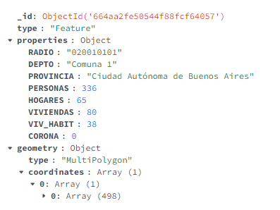

### <a id='5.2'>Información del censo </a> 

- Base de datos a utilizar: SQL Postgres.
- Justificación: La información original no tiene un formato definido; sin embargo, todos los barrios tienen la misma información: nombre del barrio, número de hombres, número de mujeres y total por edades desde 0 a 110 años (años legales) y que no cuenta con una alta latencia en transacionalidades por segundo. Por lo tanto, se organiza en formato tabular por barrio y su contenido. Se podría usar MongoDB si se quisiera adicionar información única de cada barrio (número de parques, número de playas, etc.), pero como en este caso no es necesario, se elige usar SQL.

- Base de datos **jave_database**
- tabla **census_data** 
- Muestra de datos: **columnas**

    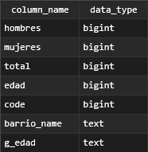

### <a id='5.3'>Información de la encuesta de bienestar </a> 

- Base de datos a utilizar: SQL.
- Justificación: La información se manejará a nivel de personas individuales en lugar de casas u hogares, lo que nos proporciona una estructura de datos definida y permite el uso de SQL

Información adicional

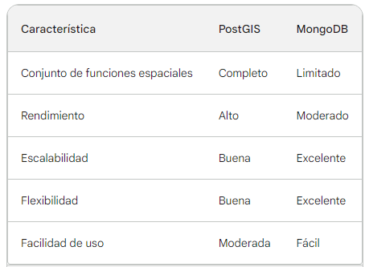

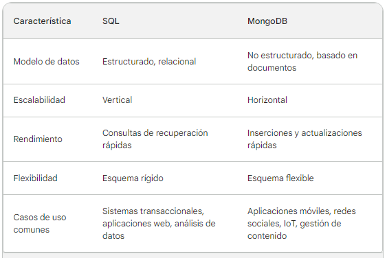

## <a id='6'>Alcance </a>  

Se implementara la siguiente arquitectura para la solución de los objetivos planteados y resolver las necesidades de la empresa dedicada a la comercialización de vestuario

Se realiza lo siguiente:

a. **Login**: Se realiza en el front-end con **HTML5**, que es una aplicación **web** que interactúa con el usuario para ingresar al sistema con credenciales de usuario o teléfono y su contraseña. Además, interactúa en el back-end con **Python** para las conexiones de validación del usuario hacia la base de datos **Cassandra**. Gracias a sus nodos, podemos consultar por usuario o teléfono, mejorando la velocidad de respuesta, la versatilidad y la eficiencia.

b. **Data Censo**: Se desarrolla un aplicativo web en el front-end con **HTML5** que interactúa con el usuario para visualizar los insumos de datos en formato .csv o parquet que serán consumidos por el sistema. Este sistema interactúa con **Python** para realizar las inserciones en las bases de datos **PostgreSQL**, las cuales son bases de datos relacionales.

c. **Data Buenos Aires:** Se desarrolla en el front-end un aplicativo web en **HTML5** que permite al usuario visualizar información geográfica en formato **GeoJSON**. Este aplicativo interactúa con **Python** para realizar las inserciones en la base de datos **MongoDB**.
        
d.**Mapas Analítica:** Se utiliza un front-end compuesto por **Kepler.gl** y **HTML5** para la visualización de los mapas. Los mapas interactúan con el usuario para permitirle observar la exploración y preparación de datos que ha realizado el aplicativo. Esta exploración tiene como objetivo encontrar análisis que permitan evidenciar estadísticamente los datos más relevantes en cuanto a la ubicación donde se comercializan más vestidos.

e.**Jupiter:** Se utiliza en la parte del back-end para la exploración y preparación de los datos con la finalidad de visualizar los datos de Buenos Aires y sus clientes.

f.**Repositorio:** Se utiliza un controlador de repositorios **GitHub** para el control de versiones.
        
g.**Data proveedores:** Se utiliza la data de los proveedores como insumo para iniciar con los análisis, exploración y preparación de los datos en formato **.csv**, **parquet** y **.geojson**. La data es open source y para evitar comprometer nombres, se limpia desde el inicio.

h.**Docker:** Se utilizan contenedores con patrón por servicios para contenerizar las bases de datos y el aplicativo.

## <a id='7'>Preguntas de negocio  </a>  

- ¿Dónde se encuentran los mejores clientes?
- ¿Los mejores o los peores clientes se encuentran más cerca o más lejos de la ubicación central?
- ¿Existe una asociación entre los mejores clientes y mayores ingresos?

## <a id='8'>Resultados esperados  </a>  

El proyecto se espera que resulte en los siguientes resultados:

- Una mejor comprensión de la distribución espacial de los clientes y las ventas.
- Una comprensión más profunda de la relación entre la ubicación de los clientes y sus características demográficas.
- Segmentos de mercado bien definidos con características y necesidades similares.
- Estrategias de ventas y marketing más efectivas dirigidas a segmentos específicos del mercado.

## <a id='9'>Atributos de Calidad  </a>  

- **Escalabilidad:** Estos contenedores son aislados y consistentes, lo que significa que la aplicación se ejecutará de manera idéntica en cualquier entorno compatible con Docker.
- **Rendimiento:** Ya depende de los recursos del servidor o la nube que utilices en RAM y almacenamiento.
- **Disponibilidad:** No tiene la capacidad de manejar la disponibilidad.
- **Seguridad:** Almacena contraseñas de forma segura en bases de datos utilizando funciones hash.
- **Mantenibilidad:** Implementa el patrón MVC (Modelo-Vista-Controlador) para mejorar la mantenibilidad.
- **Confiabilidad:** Implementa un sistema de monitoreo de errores para detectar y solucionar problemas de manera proactiva.

## <a id='10'>Descripción de la Arquitectura</a>  

### <a id='10.1'>Diagramas de Arquitectura </a> 

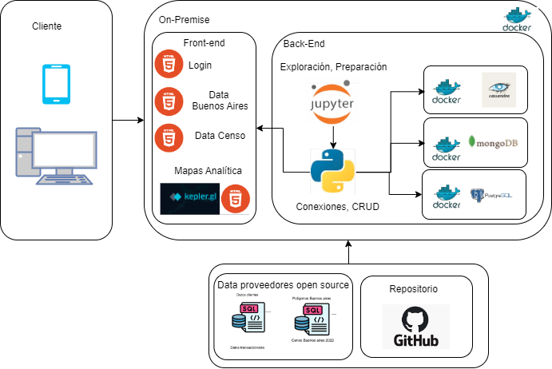

### <a id='10.2'>Componentes </a> 

1. Capa de Presentación (Flask App):

- Implementada utilizando el framework Flask de Python.
- Define las rutas HTTP para las diferentes funcionalidades de la aplicación.
- Procesa las solicitudes HTTP, valida los datos de entrada y llama a la capa de lógica de negocios para realizar el análisis geoespacial.
- Genera respuestas en formato HTML o JSON utilizando plantillas Jinja2 o librerías como Flask-JSON.

2. Capa de Lógica de Negocios:

- Contiene la lógica principal de la aplicación para realizar análisis geoespacial.
- Utiliza librerías especializadas para el manejo de datos geoespaciales, como GeoPandas y Shapely.
- Implementa funciones para procesar datos, generar mapas, realizar cálculos y análisis estadísticos.
- Se comunica con la capa de acceso a datos para obtener y almacenar datos geoespaciales.

3. Capa de Acceso a Datos:

- Abstrae la interacción con las fuentes de datos geoespaciales.
- Soporta diferentes tipos de fuentes de datos, como bases de datos relacionales, NoSQL, APIs y servicios web geoespaciales.
- Utiliza librerías y drivers específicos para cada tipo de fuente de datos.
- Proporciona una interfaz sencilla para que la capa de lógica de negocios pueda acceder a los datos geoespaciales (mapas).

### <a id='10.3'>Flujo de Datos </a>

1. El usuario envía una solicitud HTTP a la capa de presentación (Flask App) utilizando un navegador web o una aplicación cliente. La solicitud incluye información sobre el análisis geoespacial que se desea realizar, como los datos de entrada, los parámetros de análisis y el formato de salida deseado.

2. La capa de presentación valida la solicitud para asegurarse de que los datos de entrada son correctos y completos. Luego, crea un objeto de solicitud que contiene toda la información relevante de la solicitud.

3. La capa de presentación envía el objeto de solicitud a la capa de lógica de negocios. La capa de lógica de negocios utiliza el objeto de solicitud para determinar el tipo de análisis geoespacial que se debe realizar y los datos necesarios.

4. La capa de lógica de negocios llama a la capa de acceso a datos para obtener los datos geoespaciales necesarios del almacenamiento. La capa de acceso a datos utiliza los parámetros de la solicitud para identificar y recuperar los datos relevantes de las fuentes de datos correspondientes.

5. Una vez que la capa de lógica de negocios tiene los datos necesarios, procede a realizar el análisis geoespacial. Esto puede implicar procesar datos, generar mapas, realizar cálculos y análisis estadísticos.

6. La capa de lógica de negocios transforma los resultados del análisis en un formato adecuado para la presentación. Esto puede implicar convertir datos en mapas, gráficos, tablas o estructuras de datos JSON.

7. La capa de lógica de negocios devuelve los resultados formateados a la capa de presentación.

8. La capa de presentación utiliza los resultados formateados para generar una respuesta HTTP para el usuario. La respuesta puede incluir HTML para mostrar una página web con los resultados del análisis pueda procesar los datos.

9. La capa de presentación envía la respuesta HTTP al usuario. El navegador web del usuario muestra la página HTML o la aplicación cliente procesa los datos JSON.

### <a id='10.4'>Componentes </a>

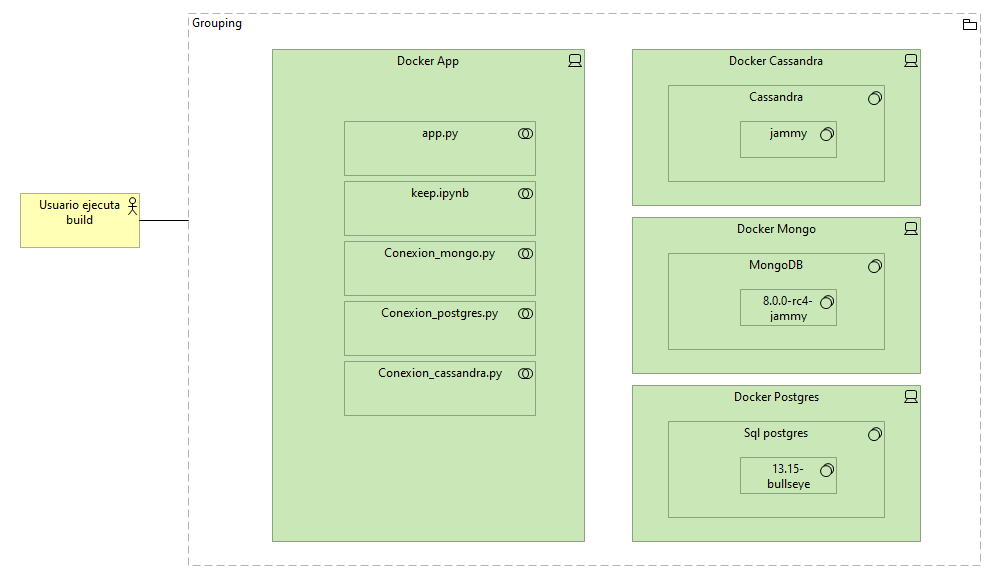

### <a id='10.5'>Tecnologías Utilizadas </a>

- **Lenguajes de Programación:** Se utilizara Python, HTML5, JavaScript, css, 
- **Frameworks y Librerías:** keplergl, dash, Flask
- **Plataformas y Servicios:** Github, netlify, Docker, GitPod

## <a id='11'>Instalación y Configuración</a>  

### <a id='11.1'>Requisitos Previos </a> 

Requisitos previos: Tener Docker instalado y ganas.

### <a id='11.2'>Uso local de la App </a> 

1. Descargar el repositorio.

```bash
ssh git clone git@github.com:japipe05/jave_buenos_aires_py_cmp.git
```

2. Ingrese a la carpeta jave_buenos_aires_py_cmp.

```bash
cd jave_buenos_aires_py_cmp
```

3. Ejecute el siguiente comando Docker:

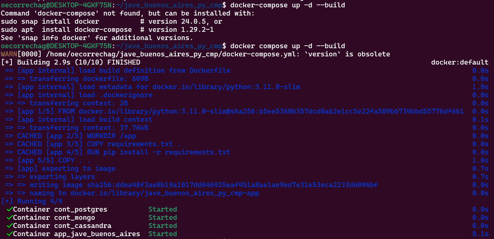

```bash
docker compose up -d --build
```

4. Nota: La base de datos Cassandra requiere un tiempo de arranque de aproximadamente 7 minutos. Se sugiere aguardar este período antes de ejecutar el siguiente comando.

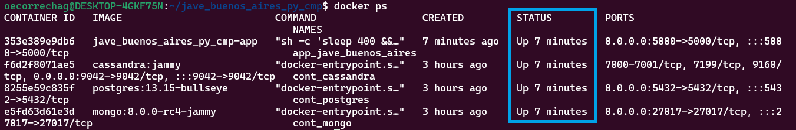

5. En su navegador de preferencia ingrese la siguiente dirección web: 

```bash
http://127.0.0.1:5000
```

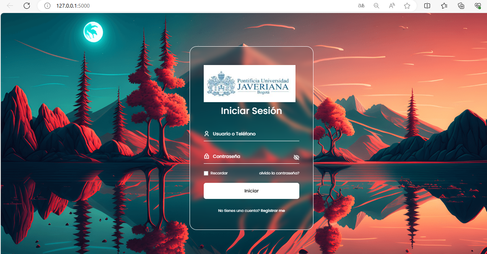

Al acceder al sitio web, se mostrará la página principal. Para continuar, deberá registrarse con un usuario, teléfono y contraseña. Luego, se le presentará la siguiente vista.

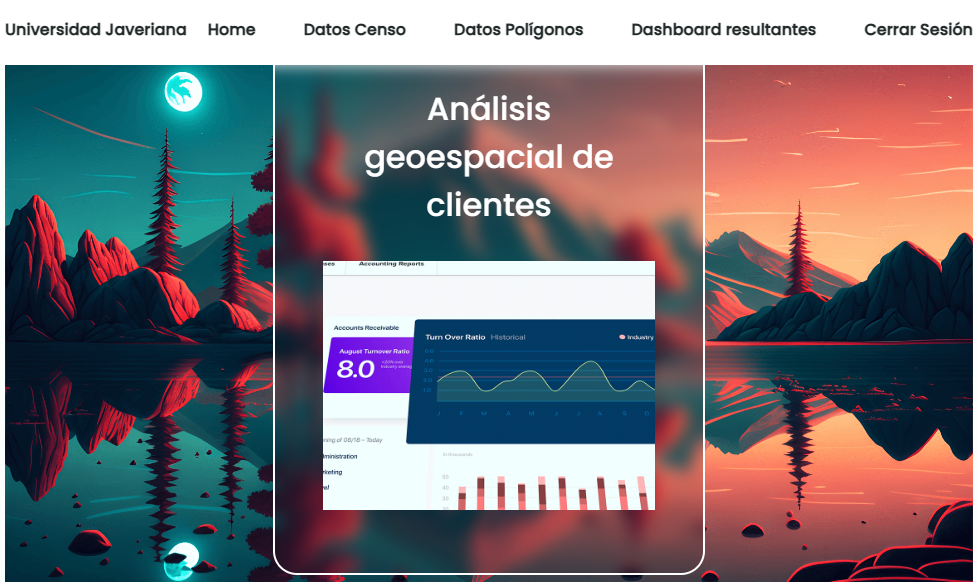

Los mapas generados se encuentran disponibles para su consulta en la pestaña Dashboards.

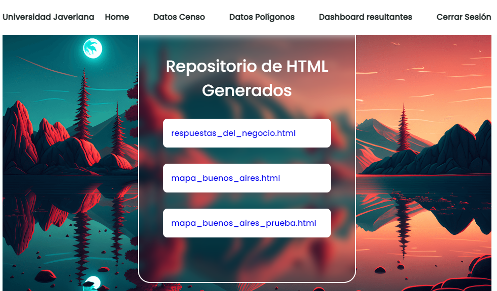

Al seleccionar un mapa, se abrirá una nueva página con el mapa en detalle.

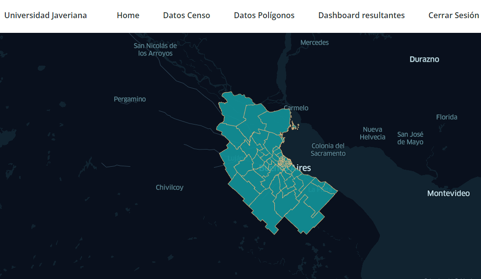

Para finalizar, haga clic en "Cerrar sesión" y luego cierre el navegador.

### <a id='11.3'>Desplegar usando GitPod </a> 

1. Ingrese al sitio web de GitPod con el siguiente enlace.

```bash
https://gitpod.io/#https://github.com/japipe05/jave_buenos_aires_py_cmp
```
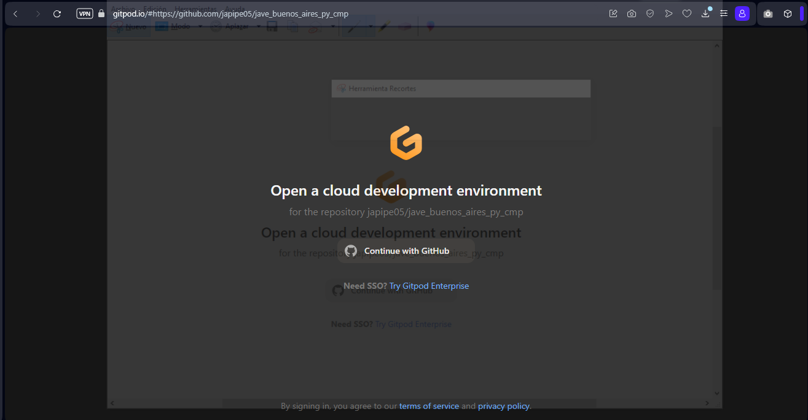

2. Acceda o cree una cuenta para ingresar al espacio del proyecto.. 

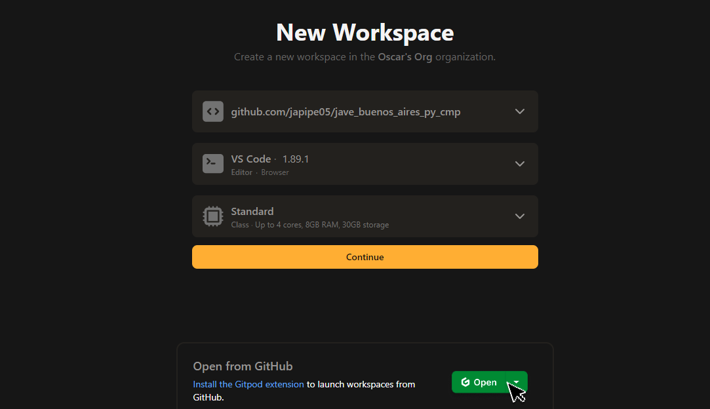

3. Al ingresar, la app de Gitpod se cargará e iniciará la instalación de los requisitos del sistema. Espere a que finalice el proceso.

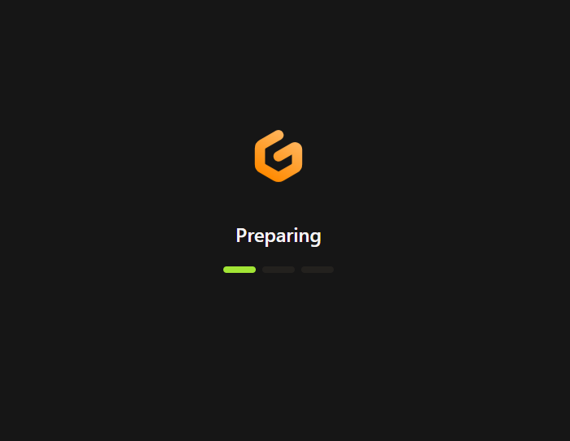

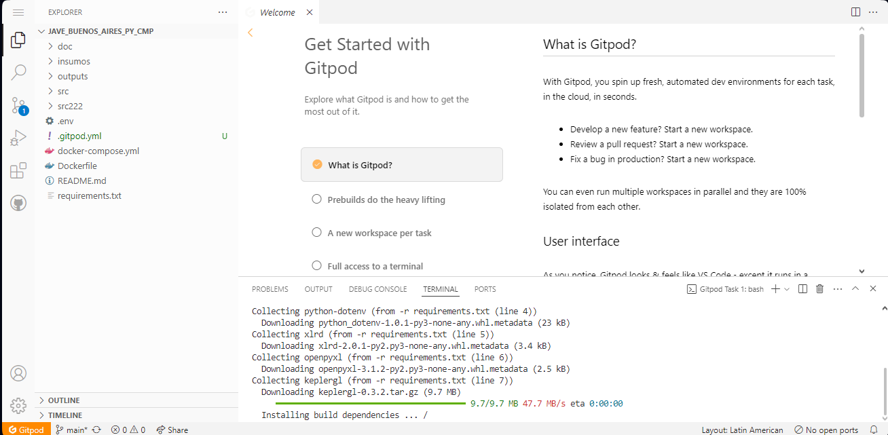

4. Ejecute el siguiente comando Docker:

```bash
docker-compose up -d --build
```
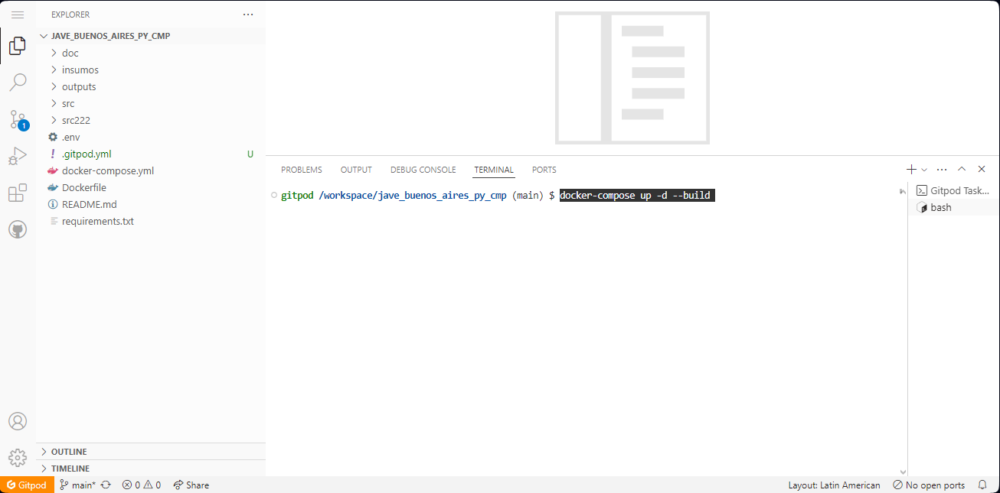

5. Nota: La base de datos Cassandra requiere un tiempo de arranque de aproximadamente 7 minutos. Se sugiere aguardar este período antes de ejecutar el siguiente comando.

6. Ejecute el siguiente comando Docker:

```bash
docker ps
```

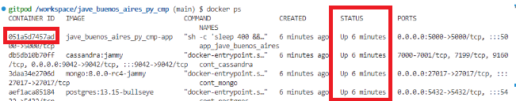

Podrá visualizar los Hash de los contenedores. Tome nota del Hash del contenedor **jave_buenos_aires_py_cmp-app**

7. Ejecute el siguiente comando Docker, no olvide reemplazar el hash de su repositorio:

```bash
docker logs <id contenedor>
```

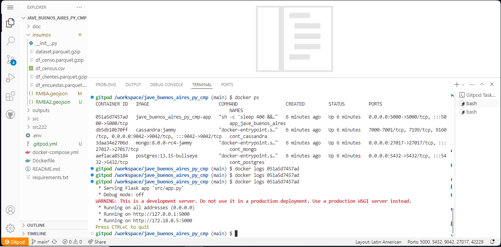

8. Mantenga presionada la tecla Ctrl (o Cmd en Mac) y haga clic en la dirección https://....

Nota: Tenga en cuenta que este es un entorno virtual, por lo que no funcionara si ingresa esta dirección directamente en un navegador en su pc. <br>

Este link le enviara a un sitio parecido al siguiente: 

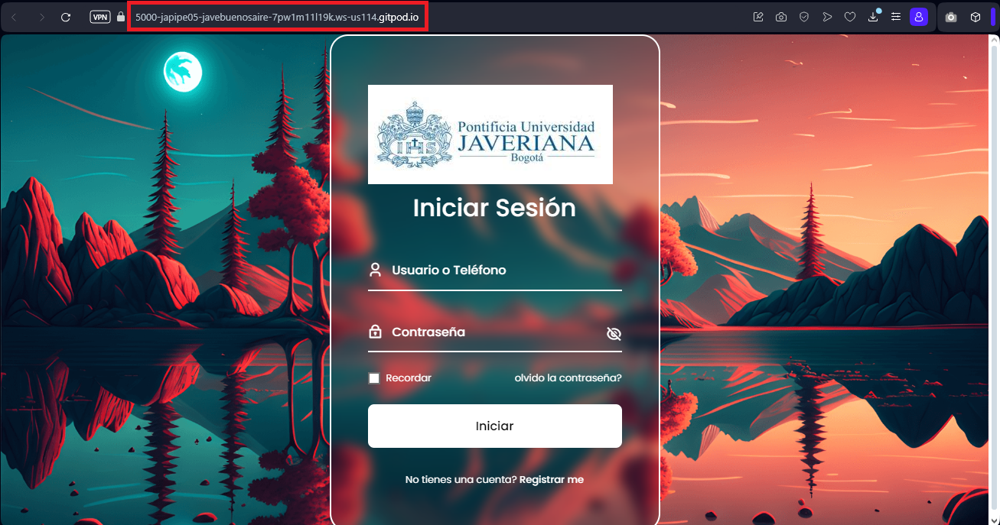


5. En su navegador de preferencia ingrese la siguiente dirección web: 

```bash
ojo Ctrl (o Cmd en Mac) http://127.0.0.1:5000
```

Al acceder al sitio web, se mostrará la página principal. Para continuar, deberá registrarse con un usuario, teléfono y contraseña. Luego, se le presentará la siguiente vista.


Los mapas generados se encuentran disponibles para su consulta en la pestaña Dashboards.


Al seleccionar un mapa, se abrirá una nueva página con el mapa en detalle.


Para finalizar, haga clic en "Cerrar sesión" y luego cierre el navegador.


## <a id='12'>Uso del Proyecto </a> 

### <a id='12.1'>Guía de Usuario </a> 

Instrucciones sobre cómo usar el proyecto.

Al iniciar un mapa con la aplicación Kepler se mostrará una vista similar a la que se muestra en la siguiente imagen.

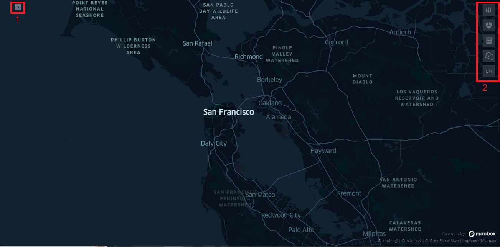

1. Viñeta para desplegar funciones relacionadas con los datos.
2. Botones para desplegar funciones relacionadas con el mapa

Al desplegar la viñeta 1 se mostrará una vista similar a la que se muestra en la siguiente imagen.

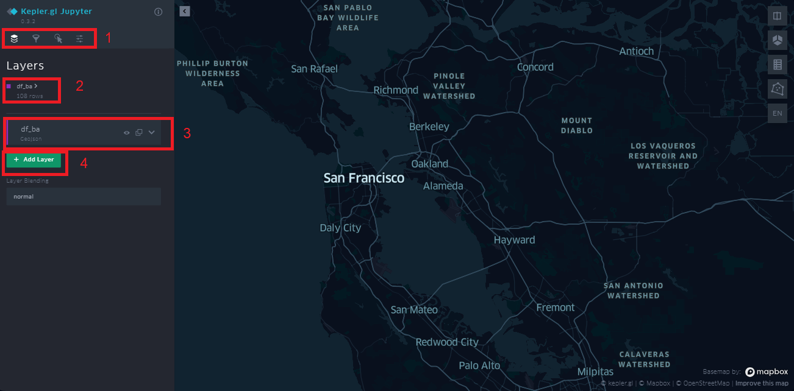

1. Botones para capas, filtros y otros.
2. Datos cargados actualmente.
3. Capas de datos cargadas actualmente; puede haber más de una capa a la vez.
4. Botón para crear una nueva capa, disponible solo si se tienen datos cargados previamente.

### <a id='12.2'>Ejemplos de Uso </a> 

Ejemplos prácticos de cómo interactuar con el sistema.

Al iniciar un mapa, en este ejemplo, los barrios y comunas del Gran Buenos aires, se mostrará una vista similar a la que se muestra en la siguiente imagen.

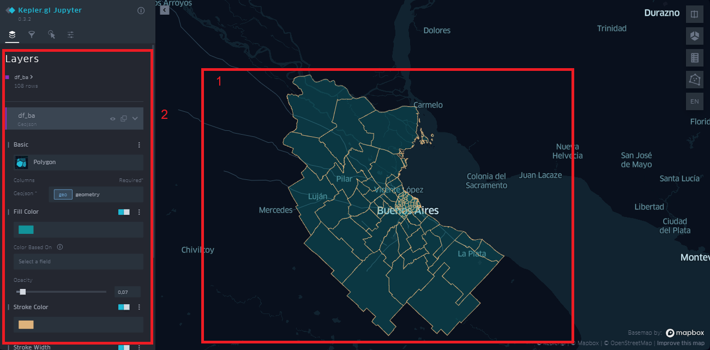

1. Mapa
2. Datos y capas cargados actualmente, los cuales se pueden modificar

En la sección de filtros, puede aplicar los filtros según sus necesidades, y se mostrará una vista similar a la que se ilustra en la siguiente imagen.

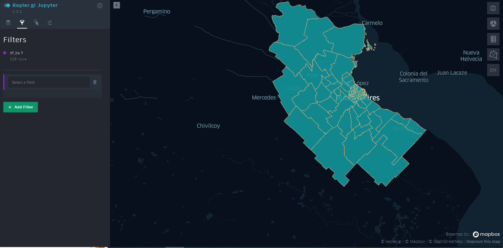 

<hr>

[Go to Top](#Table-of-Contents)

## Mantenimiento y Soporte
Guía de Mantenimiento: Procedimientos y mejores prácticas para mantener el sistema.
Soporte: Cómo obtener ayuda y soporte para el proyecto.

## Contribuciones
Guía de Contribución: Cómo otros pueden contribuir al proyecto.
Políticas de Código: Normas y políticas para contribuir con código al proyecto.

## Licencia
Licencia del Proyecto: Detalles sobre la licencia bajo la cual se distribuye el proyecto open source.

---

# Estructura del repositorio:
``` 
jave_buenos_aires_py_cmp/
├── Doc/
│   ├── archi/
│   │   └── arquitectura_componetes.archimate
│   │   └── arquitectura_componetes.archimate.bak
│   ├── img/
│   │   └── architecture.png
│   │   └── arquitectura.png
│   │   └── arquitectura_componetes.png
│   │   └──  guia1.PNG
│   │   └── guia2.PNG
│   │   └── guia3.PNG
│   │   └── guia4.PNG
│   │   └── local1.PNG
│   │   └── local2.PNG
│   │   └── local3.PNG
│   │   └── local4.PNG
│   │   └── local5.PNG
│   │   └── local6.PNG
│   │   └── logo.PNG
│   │   └── online1.PNG
│   │   └── online2.PNG
│   │   └── online3.PNG
│   │   └── online4.PNG
│   │   └── online5.PNG
│   │   └── online6.PNG
│   │   └── online7.PNG
│   │   └── tabla_postgis_mongo.PNG
│   │   └── tabla_sql_mongo.PNG
│   │   └── tipos_datos_mongo.png
│   │   └── tipos_datos_postgres.png
├── insumos/
│   └── RMBA.geojson
│   └──  __init__.py
│   └── dataset.parquet.gzip
│   └── df_ba.geojson
│   └──  df_censo.parquet.gzip
│   └── df_census.csv
│   └── df_clientes.parquet.gzip
│   └── df_encuestas.parquet.gzip
│   └── outputs/
│   │   └── __init__.py
│   │   └── map1.html
│   │   └──  map2.html
│   │   └── map3.html
│   │   └── map4.html
│   │   └── map5.html
│   │   └── mapa_buenos_aires.html
│   │   └── mapa_buenos_aires_prueba.html
│   │   └── respuestas_del_negocio.html
│   ├── src/
│   │   ├── __pycache__/
│   │   │    └── app.cpython-311.pyc
│   │   ├── config/
│   │   │    └── __init__.py
│   │   │    └── envs.py
│   │   ├── database/
│   │   │    ├── cassandra/
│   │   │    │    └── __init__.py
│   │   │    │    └── conexion.py
│   │   │    ├── mongo/
│   │   │    │    └── __init__.py
│   │   │    │    └── conexion.py
│   │   │    ├── postgres/
│   │   │    │    └── __init__.py
│   │   │    │    └── conexion.py
│   │   ├── models/
│   │   │    └── __init__.py
│   │   │    └── censo_clientes.py
│   │   │    └── dash.py
│   │   │    └── login.py
│   │   │    └── poligonos_buenos_aires.py
│   │   ├── routes/
│   │   │    └── __init__.py
│   │   │    └── censo_cliente.py
│   │   │    └── login.py
│   │   │    └── mostrar_archivo_html.py
│   │   │    └── mostrar_htmls.py
│   │   │    └── poligonos_buenos_aires.py
│   │   │    └── principalindex.py
│   │   │    └── registrando.py
│   │   │    └── registro.py
│   │   ├── static/
│   │   │    ├── css/
│   │   │    │    └── styles.css
│   │   │    │    └── styleshome.css
│   │   │    ├── img/
│   │   │    │    └── home.gif
│   │   │    │    └── home.jpg
│   │   │    │    └── login-bg.png
│   │   │    ├── js/
│   │   │    │    └── main.js
│   │   │    │    └── mainhome.js
│   │   │    ├── scss/
│   │   │    │    ├── base/
│   │   │    │    │    └── _base.scss
│   │   │    │    ├── components/
│   │   │    │    │    └── _breakpoints.scss
│   │   │    │    │    └── _login.scss
│   │   │    │    ├── config/
│   │   │    │    │    └── _variables.scss
│   │   │    │    └── styles.scss
│   │   ├── templates/
│   │   │    └── censo_cliente.html
│   │   │    └── contenidoweb.html
│   │   │    └── error.html
│   │   │    └── home.html
│   │   │    └── index.html
│   │   │    └── listadosweb.html
│   │   │    └── login.html
│   │   │    └── poligonos_buenos_aires.html
│   │   │    └── registro.html
│   │   └── app.py
│   │   └── keep.ipynb
│   │   └── preguntas_negocio.ipynb
└── .env
└── Dockerfile
└── README.md
└── docker-compose.yml
└── requirements.txt
```

- **Doc/**:Carpeta de documentos de arquitectura
    - **archi/**:Carpeta de documentos de arquitectura
         - **archi/**: Carpeta donde se alojan los archivos de archi
             - **arquitectura_componetes.archimate**: Diagrama de componentes de arquitectura
             - **arquitectura_componetes.archimate.bak**: Diagrama de componentes de arquitectura
        - **img/**:imagenes de instalación y de la aplicación
            - **architecture.png**: Diagrama de componentes de arquitectura
            - **arquitectura.png**: Diagrama de arquitectura de la aplicación
            - **guia1.PNG**: Diagramas de kepler filtros
            - **guia2.PNG**: Diagramas de kepler mapas
            - **guia3.PNG**: Diagramas de kepler filtros avanzados
            - **guia4.PNG**: Diagramas de kepler poligonos
            - **local1.PNG**: Instalaciones docker
            - **local2.PNG**: Instalaciones docker
            - **local3.PNG**: login app
            - **local4.PNG**: home
            - **local5.PNG**: repositorio de archivos kepler generados
            - **local6.PNG**: Git pod instalaciones
            - **online1.PNG**: Git pod instalaciones 1
            - **online2.PNG**: Git pod instalaciones 2
            - **online3.PNG**: Git pod instalaciones 3
            - **online4.PNG**: Git pod instalaciones 4
            - **online5.PNG**: Git pod instalaciones 5 
            - **online6.PNG**: Git pod instalaciones 6
            - **online7.PNG**: Git pod instalaciones 7
            - **tabla_postgis_mongo.PNG**: tipos de datos de mongo
            - **tipos_datos_postgres.png**: tipos de datos mongo
        - **insumos/**:Fuentes origen de la data para el análisis
            - **RMBA.geojson**: Datos del geoJson que se aloja en mongo DB
            - **df_census.csv**: Datos que se aloja en postgres
            - **dataset.parquet.gzip**: Datos que se utilizan para el anlisis desde jupiter para la generacion de los archivos kepler
        - **outputs/**:archivos del repositorio de los archivos keppler donde se encuentra en anlisis de los poligonos de buenos aires
            - **map1.html**: mapa de kepler del primer análisis de los poligonos de buenos aires
            - **map1.html**: mapa de kepler del primer análisis de los poligonos de buenos aires
            - **map2.html**: mapa de kepler del segundo análisis de los poligonos de buenos aires
            - **map3.html**: mapa de kepler del tercer análisis de los poligonos de buenos aires
            - **respuestas_del_negocio.html**: respuestas para el negocio de análisis para la captación de los clientes en buenos aires
        - **src/**: componentes de la aplicación
            - **config/**: configuración de variables de la aplicación
                - **envs.py**: variables de entorno utilizada para las conexiones de base de datos
            - **database/**: conexiones de base de datos
                - **Cassandra/**: Conexiones de cassandra
                       **conexion.py** Conexión hacia cassandra
                - **MongoDb/**: Conexiones de mongoDb
                       **conexion.py** Conexión hacia MongoDb
                - **postgres/**: Conexiones de postgres
                      - **conexion.py** Conexión hacia posgtgresf
             - **models/**: modelos de la aplicación para
                 - **censo_clientes.py** ingesta de datos y querys realizadas hacia los repositorios de base de datos postgres
                 - **login.py** consulta de los nodos de cassandra
                 - **poligonos_buenos_aires.py** consulta a las bases de datos de mongoDb
             - **routes/**: rutas para la consultas de la aplicación
                 - **censo_cliente.py** CRUD de los datos del cliente hacia el front-end que se obtendrá de potgres
                 - **poligonos_buenos_aires.py** CRUD de los datos del cliente hacia el front-end que se obtendrá de mongoDb
                 - **login.py** login de la aplicación utilizando casandra para que pueda ingresar por teléfono o usuario en múltiples nodos optimizando y mejorando la disponivilidad al ingreso de la sesión y multimples usuarios
                 - **registrando.py** CRUD registro de la aplicación en cassandra
                 - **mostrar_archivo_html.py** front-end donde se alojan los archivos a visualizar los archivos keppler
             - **static/**: muestra los archivos de css, javascript utilizados en el front-end e imágenes utilizadas 
                 - **css/** css para la visualización del frontend utilizados
                     - **styles.css** configuración de los efectos utilizados en el fornt-end
                 - **js/** js archivos para el control de los movimientos y efectos
                     - **script.css** movimientos y efectos utilizados en la parte del front-end
                - **img/** imágenes utilizadas en la app
                     - **home.gif** animado del home
                     - **login-bg.png** logo login javeriana
                - **Templates/** imágenes utilizadas en la app
                     - **login.html** login de inicio de sesión
                     - **registro.html** registro de la aplicación
                     - **home.html** inicio del home de la aplicación
                     - **censo_cliente.html** pantalla de los datos del cliente
                     - **poligonos_buenos_aires.html** Datos de los poligonos de buenos aires
                     - **listadosweb.html** listas de html del repositorio
                - **app.py** llamado de los routes y inicio de la aplicación
                - **keep.ipynb** jupiter para el anlaisis de la exploración y preparación de los datos
    - **.env** variables de entorno para accesos para la configuración de usuarios en las bases de datos
    - **Dockerfile** archivo de despliegue de librerías de python utilizadas
    - **README.md** detalle de la aplicacién con sus especificaciones técnicas
    - **docker-compose.yml** Dokerización de las bases de datos de postgres, mongoDb, cassandra y la aplicación
    - **requirements.txt** librerías necesarias para la aplicación
